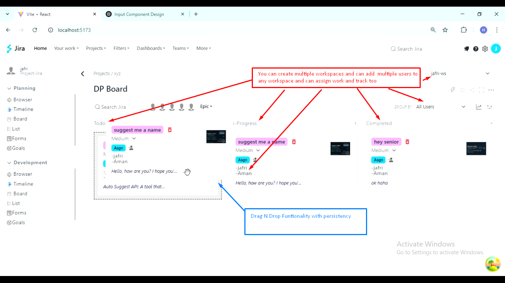
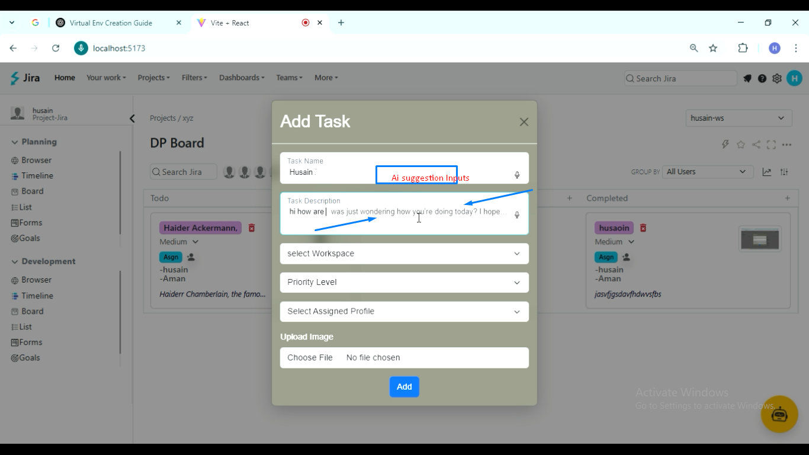
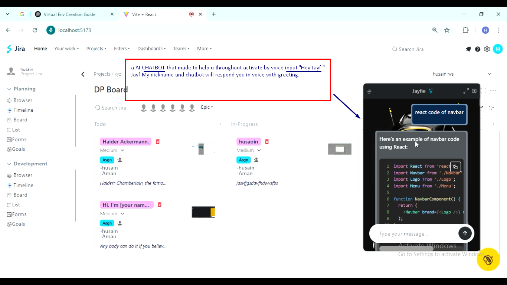
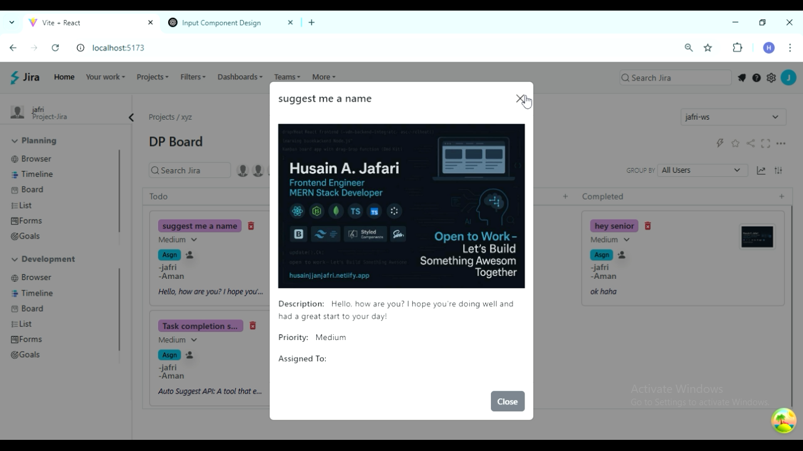
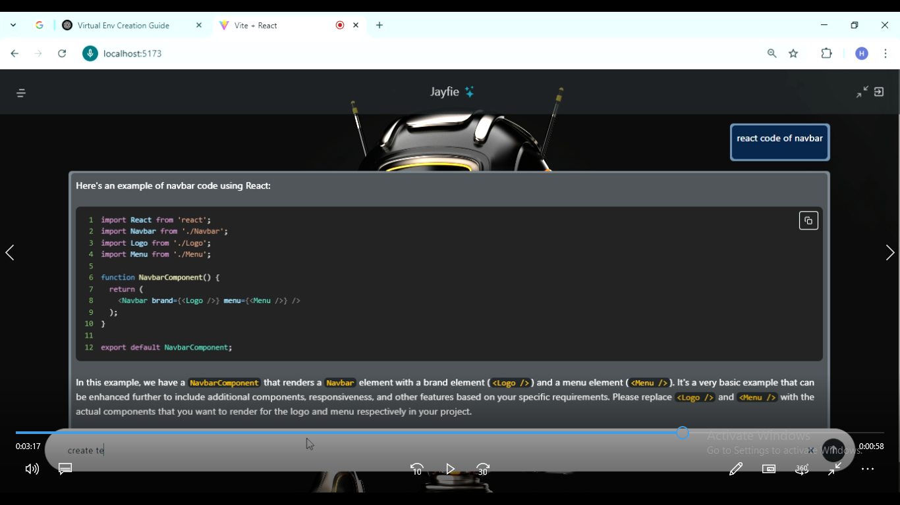

# 🚀 TaskMate-AI — AI-Powered Project Management (Jira-like)

**TaskMate-AI** is a modern **MERN-stack project management platform** that blends Kanban workflows with **AI automation** — featuring smart task suggestions, voice-driven chat, and intelligent context-based task handling.  
Built using **React**, **Redux Toolkit**, **TanStack Query**, **@dnd-kit**, **Node.js**, **Express**, and **MongoDB**, it offers a secure and scalable foundation for enterprise-grade productivity.

---

### TaskMate Dashboard



## ✨ Quick Pitch
A next-gen project management system that merges AI assistance with collaborative task management — offering authentication, protected layouts, advanced caching, and robust error handling for real-world use.

---


## 🔑 Key Features

### 🧑‍💻 Authentication & Authorization
- JWT-based login and session management  
- Role-Based Access Control (Admin / Manager / Member / Guest)  
- Project and workspace-level permission rules  

### 🔐 Protected Layouts & Secure Routes
- Route-level protection for authorized access  
- Role-aware UI rendering (buttons/forms hidden for unprivileged users)  
- View-only mode for external collaborators  

### 🗂️ Task & Workflow Management
- Kanban board powered by **@dnd-kit** (drag, drop, reorder with persistence)  
- Task assignments, priority levels, and sub-task tracking  
- Dynamic filtering, sorting, and search  

### 🤖 AI Integrations
- **Smart task suggestions** (powered by OpenAI / Cohere APIs)  
- **Voice command assistant** for quick task updates or queries  
- **AI auto-complete** for task descriptions and project summaries  

### ⚡ Performance & Data Handling
- **TanStack Query** for advanced caching, background refetching, and retries  
- Optimistic UI updates with rollback on failure  
- Lazy loading and pagination for heavy datasets  

### 🧩 Error Handling & Edge Cases
- Centralized error middleware on the backend  
- Global React error boundary for front-end crashes  
- Permission-denied and resource-not-found handlers  

### 📊 Data Integrity & Logging
- Task activity history and audit trail per user  
- Soft-delete with recovery options  
- Concurrency-safe updates  

### 🧱 Architecture & DevOps
- **MERN Stack**: React + Node.js + Express + MongoDB  
- Modular folder structure for scalable backend  
- Environment-based configuration (.env for dev/prod)  
- CI/CD-ready setup (GitHub Actions compatible)  

### 🔒 Security Highlights
- Encrypted passwords and JWTs  
- Input sanitization and rate limiting  
- Strict access to protected API endpoints  

---


### AI Ghost Suggestion Hit Tab to complete


### S3


### S4


### S5



### Client
- **React** for building the user interface.
- **Redux Toolkit** for state management.
- **React Query** for server state management and caching.
- **Drag-and-Drop** functionality using `@dnd-kit`.
- **Speech Recognition** for voice commands in the chatbot.
- **AI Suggestions** for smart input fields using OpenAI API.
- **Bootstrap 5** for responsive design and styling.

### Server
- **Node.js** and **Express** for building the REST API.
- **MongoDB** as the database for storing tasks, users, and workspace data.
- **JWT Authentication** for secure user login and session management.
- **OpenAI API** integration for AI-powered features.
- **Cohere API** for additional AI capabilities.

---

## Project Structure

### Client
Located in the `Client` folder:
- **Components**: Reusable React components like `Dnd`, `SmartInput`, `ChatBot`, etc.
- **Pages**: Main pages like `Home`.
- **Redux**: State management using Redux Toolkit.
- **Assets**: Bootstrap CSS/JS and other static files.
- **Hooks**: Custom hooks for fetching data and managing state.
- **API**: API service files for interacting with the backend.

### Server
Located in the `Server` folder:
- **Routes**: API endpoints for tasks, users, and workspaces.
- **Controllers**: Business logic for handling API requests.
- **Models**: MongoDB schemas for tasks, users, and workspaces.
- **Middleware**: Authentication and error handling middleware.
- **Environment Variables**: Stored in `.env` for sensitive data like API keys and database credentials.

---

## Installation

### Prerequisites
- **Node.js** (v16 or higher)
- **MongoDB** (local or cloud instance)
- **npm** or **yarn**

### Steps
1. Clone the repository:
   ```bash
   git clone https://github.com/your-repo/JiraClone-React-RTK.git
   cd JiraClone-React-RTK
   ```

2. Install dependencies for both `Client` and `Server`:
   ```bash
   cd Client
   npm install
   cd ../Server
   npm install
   ```

3. Set up environment variables:
   - Create a `.env` file in the `Server` folder with the following:
     ```env
     PORT=5000
     JWT_SECRET=your_jwt_secret
     MONGODB_URL=your_mongodb_connection_string
     OPENAI_API_KEY=your_openai_api_key
     COHERE_API_KEY=your_cohere_api_key
     ```

4. Start the development servers:
   - **Client**:
     ```bash
     cd Client
     npm run dev
     ```
   - **Server**:
     ```bash
     cd Server
     npm start
     ```

5. Open the application in your browser:
   ```
   http://localhost:5173
   ```

---

## Scripts

### Client
- `npm run dev`: Start the development server.
- `npm run build`: Build the application for production.
- `npm run preview`: Preview the production build.
- `npm run lint`: Run ESLint to check for code quality.

### Server
- `npm start`: Start the server.
- `npm run dev`: Start the server in development mode with hot reloading.

---

## Key Features

### Drag-and-Drop
- Implemented using `@dnd-kit` for task management in Kanban-style boards.

### ChatBot
- Voice-activated chatbot using `SpeechRecognition` API.
- Integrated with OpenAI for intelligent responses.

### Smart Input
- AI-powered suggestions for input fields using OpenAI API.
- Speech-to-text functionality for enhanced user experience.

### Authentication
- JWT-based authentication for secure login and session management.

---

## Dependencies

### Client
- **React**: Frontend library.
- **Redux Toolkit**: State management.
- **React Query**: Server state management.
- **@dnd-kit**: Drag-and-drop functionality.
- **Bootstrap 5**: Styling and responsive design.
- **Formik**: Form handling.
- **Lodash**: Utility functions.

### Server
- **Express**: Web framework.
- **Mongoose**: MongoDB object modeling.
- **jsonwebtoken**: JWT authentication.
- **dotenv**: Environment variable management.
- **OpenAI API**: AI-powered features.
- **Cohere API**: Additional AI capabilities.

---

## Environment Variables

The following environment variables are required for the project:

### Server
- `PORT`: Port for the server (default: 5000).
- `JWT_SECRET`: Secret key for JWT authentication.
- `MONGODB_URL`: MongoDB connection string.
- `OPENAI_API_KEY`: API key for OpenAI integration.
- `COHERE_API_KEY`: API key for Cohere integration.

---

## Folder Structure

```
JiraClone-React-RTK/
├── Client/
│   ├── src/
│   │   ├── Components/
│   │   ├── Pages/
│   │   ├── redux/
│   │   ├── hooks/
│   │   ├── api/
│   │   ├── assets/
│   │   └── main.jsx
│   ├── public/
│   └── package.json
├── Server/
│   ├── routes/
│   ├── controllers/
│   ├── models/
│   ├── middleware/
│   ├── .env
│   └── package.json
└── README.md
```

---

## License

This project is licensed under the MIT License. See the [LICENSE](LICENSE) file for details.

---

## Contributing

Contributions are welcome! Please fork the repository and submit a pull request.

---

## Contact

For any inquiries, please contact:
- **Name**: Husain A. Jafari
- **Email**: jafrihusain000@gmail.com
